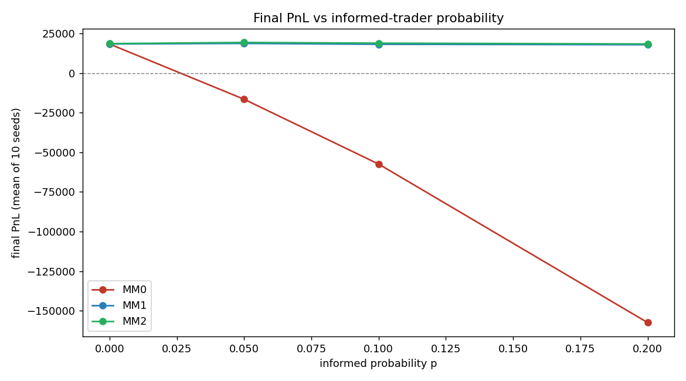
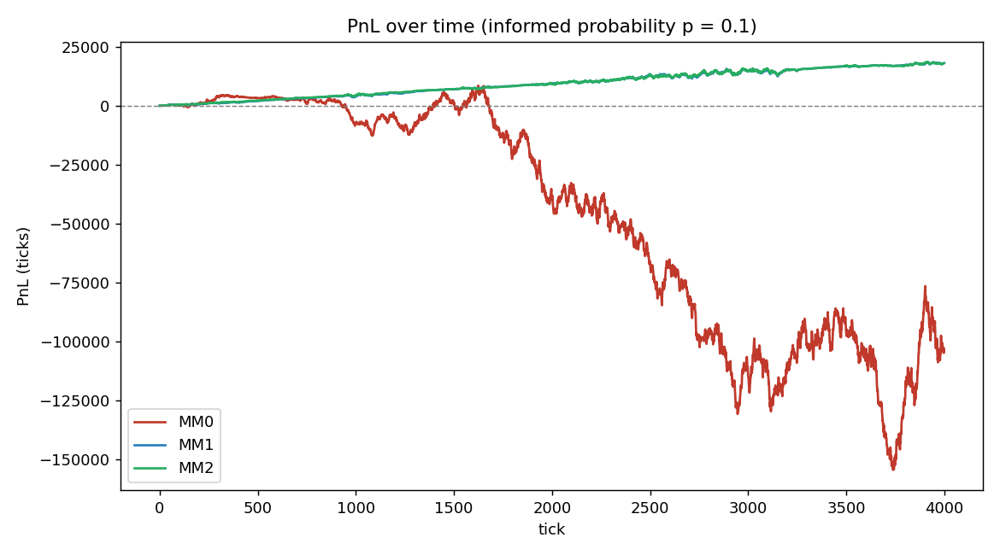
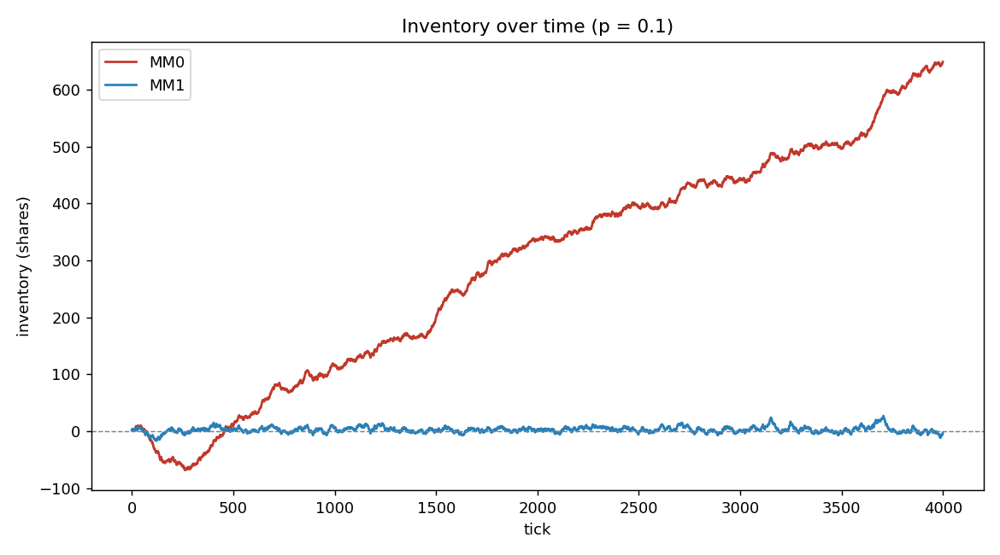

### README.md

*William Liu* --- `July 2026`

This README is divided into a few sections of interest.
- table of contents in progress

## Project Background
### high level overview

My goal is in this project is to deliver a GitHub repo and set of experiments that involve:
- A **matching engine** --- accepts limit orders, market orders, etc and emits trades
- A **market simulator** --- something that generates order flow from artificial participants which include "noise traders" (random orders, think your average Robinhood guy) and "informed traders" (those who can see and predict price movement, think big shops)
- A **market-making agent** --- an agent that quotes a bid, ask, earns the spread, and manages the inventory

Why I'm doing this: I read recently about market-makers in Matt Levine's *Money Things* newsletter, which I have been reading over coffee in the morning. This is a nice way to explore that technically + get a quant project going.

Also, such a project seemed relevant since I've seen a fair share of "things to build for quant finance" in my reels. That prompted some research out of me; by research, I mean asking Claude what this was about, talking to some friends at Citadel/HRT, and finally, concluding that this project would be productive for my own learning and career goals.

Before I began building this, I wanted to have a deeper understanding of the fundamentals at play. So I read the following materials, in no intentional order:
- Jean-Philippe Bouchard, *Trades, Quotes, and Prices*, chapters 3-5
- Marco Avellaneda and Sasha Stoikov, *High-freqency trading in a limit order book*
- Kris Machowski, *An Introduction to Limit Order Books*
- Crypt0Grapher on Substack, *Lecture 4: The Glosten-Milgrom Market Maker*
- Optiver, *Orders and the order book*
- Wikipedia, *Central limit order book*
- B2Broker, *What is a Limit Order Book?*

I then summarized some key points of these readings in the next section below.

### main result

The headline experiment (full detail in [results and discussion](#results-and-discussion)): a naive market maker earns a healthy profit in a pure-noise market, but its PnL **collapses** as informed flow rises --- from **+18k** ticks at zero informed traders to **−157k** at 20% informed. Adding inventory skew (MM1) and a flow-toxicity filter (MM2) recovers essentially all of that loss; both stay near **+18k** across every informed level.



### markets and limit order books

Any market in human history requires buyers and sellers. They must make a trade at a price that is fair to both. The goal of any market is to pool this activity in one, efficient place that allows for liquidity and price discovery.

**Liquidity**: the ease with which an asset or security can be converted into ready cash without affecting its market price
- Low demand ruins liquidity since a seller has to change the price to get it sold. Low supply also ruins liquidity since the price must go up if there are too many buyers.

**Price discovery**: the process by which the price of an asset is set -- buyers walking around and looking at sellers' asks, or sellers going around and trying to figure out buyers' bids. The latter is far harder than the former; this is often denoted *information asymmetry*.

A **limit order book** aims to solve the problem of information asymmetry. Traders can look at both buyers/sellers and immediately know what they need to know.
- There is a unique order book per stock/security.
- Each participant can place as many orders as they want -- each represents an intention to trade. Orders contain the following:
	- **side**: whether you would like to buy or sell.
	- **quantity**: how much, e.g. 100 shares
	- **limit price**: highest price you will buy / lowest price you will sell
	- **submission time**: when you sent this order in
- There are some restrictions to how one can place their orders.
	- **tick size**: the difference between price levls that you can choose from, e.g. 100, 100.5, etc
	- **lot size**: minimum quantity multiple (100, 200, 300, etc)
- The core actions you can perform as a participant are
	- Make a new order
	- Cancel an order (even midway through it being filled)
	- Amend an order (might lose you queue priority)

The order book is divided into **bid** and **ask** sides.
- Order books are sorted based on **price/time priority**. The bid-side has the highest price on top, the ask-side has the lowest price on top. That means the top of the book has the best order -- referred to as **TOB**.
	- As you go downward, you go "deeper into the book"
- The second sorting condition, time, means that the earlier-submitted order has higher priority. A *queue* is a useful data structure here, from COS 226.
- Sometimes, size and brokers are used to determine priority as well.

The **spread** is the gap between the best bid and the best ask.
- Market makers try to "earn the spread" by buying at a low price and selling at a high one -- they insert themselves into the market here and earn a few cents every time.
	- They try to be on both sides, otherwise they'll hold a bunch of shares -- "left holding the bag."
- We can also define the **mid price**, which is a useful marker for where the market is.

$$m = \text{mid price} = \frac{\text{best bid} + \text{best ask}}{2}$$

Orders can be either passive or aggressive with respect to the spread:
- **Passive**: they don't cross the market price, e.g. their $\text{limit price} < \text{best ask price}$, or their $\text{limit price} > \text{best bid price}$
	- These orders sometimes just sit there, called **resting orders**.
	- This adds liquidity since there are more shares available on the market.
- **Aggressive**: any order that crosses the spread, executing at the market price
	- This usually results in a trade or exchange -- that is, your order has been filled.
	- Another way of saying this is to "hit the bid" or "lift the ask."
	- This removes liquidity since there are less shares available on the market.

Traders just keep looping the following until nothing can be done.
1. Is the price more/equally passive than our orders' limit price?
2. Do we have quantity left to match on our order?

One order can **partially fill** another or fill multiple -- you just keep on looping. That is why it's called a **limit price**: you don't fill anything beyond it, you just fill up to it.
- Sometimes, you might be concerned with the **VWAP**: volume-weighted average price

$$\text{volume-weighted average price} = \frac{(p_1 \cdot v_1) + \dots + (p_n \cdot v_n)}{v_1 + \dots + v_n}$$

where $p_i$ and $v_i$ represent the price and volume of the $i$-th order.

**Basis points (bps)**: unit of measure for a percentage such that $1\% = 100 \text{ bps}$.

There are different ways in which people can place orders:
- **Limit order**: you have a limit price (the worst price for you) and you hope you can do a bit better than that
	- Avoids slippage -- see below.
- **Market order**: buy at whatever price is available. By definition, this is *aggressive*.
	- You have no control over what price you match at, so this is risky. If you trade a large quantity, you might encounter **slippage**: you trade against more and more people that might have greater and greater prices.
	- Slippage can be positive or negative depending on how the market is moving.
- **Stop order**: only enters the book when a certain condition is met
- **Time in Force (TIF)** also allows you to specify how long you want your order to be active for
	- Day, Good Till Cancel (GTC) are self-explanatory
	- Immediate or Cancel (IOC): if passive not aggressive, get rid of it
	- Fill or Kill Order (FOK): if order is not fully filled, cancel it

There are different levels of data, increasingly expensive and hard to stream:
- **Level 1 (L1)**: the top of the book --- the bid and the ask, quantity available at the price, what we might call the basic "quote"
- **Level 2 (L2)**: an order book with more than the top level --- list of price levels and quantities.
- **Level 3 (L3)**: an order book with all individual orders, not just aggregated
	- used by very technical quantitative trading firms and market makers

We can think about **depth of liquidity** of a market by calculating an impact price.
- **impact price**: the best bid/ask for a market order of a certain quantity
	- Suppose your quantity is 1,000 --- after executing it, what will the bid/ask be?
- a **depth chart** is U shaped
	- starts at 0 at the mid price (all trades will have been executed)
	- as you move outward, each side gains more cumulative liquidity since there are more buyers willing to buy low and more sellers willing to sell high

###  glosten-milgrom model

There's a pretty well-known **Glosten-Milgrom model** for market-makers that Claude told me about and I found interesting. It was also in a recent article by Matt Levine. Here is some context for that:

The GM framework says that by making money off the spread repeatedly, market makers can offset the risk of trading against informed hedge funds.
- Greater **adverse selection risk** --> greater the spread

In every period, we have three players:
1. **Market-maker**, denoted $MM$. They post bid $b$, ask $a$, and must earn at least $0$ PnL. (Even if they make no money here, they can make money elsewhere)
2. **Informed trader**, denoted $I$. They know the true price $v$. Let the chance of them showing up be denoted $\mu$.
3. **Noise trader**, denoted $N$. They are a random player and have $1 - \mu$ chance of arriving to the market.

Then, we can model their behavior:
- If $I$ sees high $v$, they buy at the ask. If $I$ sees low $v$, they sell at the bid.
- $N$ buys or sells 50-50, they're a coinflip.
- $MM$ only observes the side of the incoming order, but doesn't know $I$ vs $N$.

For simplicity, assume the true value $v$ either is $v_L$ or $v_H$, low or high respectively.

Let $q$ be the prior probability that the asset is high-valued.

$$P(v = v_H) = q$$

Then the chance an *informed* orderer makes a buy is given by
- numerator: the informed trader arrives, in which the asset *is* high valued (so he buys)
- over the total probability of observing a buy (informed trader + noise trader making a random bet with 50-50 odds)

$$P[I \mid \text{buy}] = \frac{\mu q}{\mu q + \frac{1-\mu}{2}}$$

Then we can find what our expected value really is:
- if it was an informed buy, the value is certainly $v_H$
- if it was a noise buy, we are still guessing, hence $E[v] = qv_H + (1-q)v_L$

$$E[v \mid \text{buy}] = P[I \mid \text{buy}] \, v_H + (1 - P[I\mid\text{buy}]) \, E[v]$$

As the market maker, we then need to
- charge a buyer the value we expect, conditional on a buy
- pay a seller the value we expect, conditional on a sale

$$a = E[v \mid \text{buy}] \hspace{20pt} b = E[v \mid \text{sell}]$$

Then we can get the spread

$$S = a - b = P[I\mid \text{buy}] (v_H - E[v]) + P[I\mid\text{sell}](E[v] - v_L)$$

There are two insurance premiums here on both sides depending on if the informed trader buys/sells. If there is a higher $\mu$, or probability of the trader being informed, then there is a larger spread.
- In other words, *the spread is an insurance premium against informed flow*.

### notes on inventory

**Avellaneda and Stoikov** did a study on a stock dealer's strategy when faced with inventory risk due to stock price and Poisson arrival of market buy/sell orders.

They propose an "inventory-based" strategy.
1. Dealer computes a personal indifference valuation for stock given his current inventory.
2. Calibrates his bid/ask quotes to the market's limit order book.

In the literature, the common sources of risk facing the dealer are
1. inventory risk arising from uncertainty in the asset's value
2. asymmetric information arising from informed traders

I implement the specific math below in **part 3**.

## part 1: matching engine

First, setting up straightforward classes for each **order**, each **trade**, and then the **book** itself. This section contains very little math and is mostly SWE/DSA.

```python
class Order:
    id: int          # Unique ID assigned by the exchange.
    side: Side       # Buy or sell.
    price: int       # Integer ticks; ignored for market orders.
    quantity: int    # Remaining quantity (changes as the order is filled).
    timestamp: int   # Monotonically increasing arrival counter.


class Trade:
    buy_id: int
    sell_id: int
    price: int       # The resting order's price (price-time priority).
    quantity: int
    timestamp: int


class OrderBook:
    def submit_limit(self, side, price, quantity)  -> (order_id, list[Trade])
    def submit_market(self, side, quantity)        -> (order_id, list[Trade])
    def cancel(self, order_id: int)                -> bool
    def best_bid(self) -> int | None
    def best_ask(self) -> int | None
    def mid(self)      -> float | None
```

This **matching engine** adheres to the following logic:
1. If the order has quantity > 0 and it crosses the best price of the other side: that is, if $\text{price} \geq \text{best ask}$, walk ask side, if $\text{price} \leq \text{best bid}$, walk bid side
	1. produce a Trade at the resting order's price
	2. decrement quantities as needed
2. Rest all remainders (don't do this if market order, just discard remainder because if there's no available liquidity, it's done)

A few misc design choices here:
- the exchange assigns an "ID" to every order and returns it, so you can cancel it later
- the prices are integers rather than floats --- this is apparently how real venues quote, and avoids float-comparison bugs
- for `class Trade`, let `price` = resting order's price
	- this is because the person who is resting should get their price; an aggressor shouldn't have to pay more than the resting price even if they cross the spread
- `submit_limit` and `submit_market` return the assigned order id and a list of trades produced by that order, possibly empty
- for `cancel`, I decided to let this return a boolean (True if something was removed, False if the id is unknown or already filled --- a stale cancel is a normal event in a live market, not an error)

To satisfy such requirements, I chose the following data structures:
- Time-priority sorting of orders: `collections.deque`
	- FIFO -- queue when order arrives, pop when matched. $\Theta(1)$ both ends
- All orders at a price level:  `dict[int, deque]`
	- i.e. price 100 --> {order#1, order #2, order#3}. $\Theta(1)$ access
- Best-price selection: `heapq`
	- $\Theta(\log n)$ push/pop.
	- uses **lazy deletion** (as a stale price rises to the top, it gets discarded) which solves the "get rid of something in the middle of the heap" problem
	- max-heap for bids (get highest price) vs min-heap for asks (get lowest price)
- Cancel an order by its ID: `dict[int, Order]`
	- $\Theta(1)$ to locate the order.

A few tests I'm planning on doing (more in the code)
1. Limit order rests when it doesn't cross, best bid/ask update correctly
2. Crossing order fills at the _resting_ order's price (price improvement) — this one catches the most bugs
3. Partial fill: incoming 100 vs. resting 60 → one trade of 60, remainder 40 rests
4. Time priority: two resting orders at the same price fill in arrival order
5. Cancel of a partially filled order removes only the unfilled remainder
6. A market order walking multiple price levels produces multiple trades at different prices
7. Cancel of a nonexistent/already-filled id is handled cleanly

The full suite lives in `tests/` and runs with `pytest` (42 tests, all green). The nastiest bug they caught was a **stale heap entry**: when a price level empties and is later recreated, the old (now invalid) heap entry has to be skipped, or `best_ask()` reports a price with no liquidity behind it. The `test_recreated_price_level_still_best` case pins this down.

## part 2: market simulator

Now, setting up the "synthetic world of traders." We will include "informed traders" and "noise traders," with the former knowing the actual fair value.

Let $V$ be the fair value, the "correct" price given all the real information out there.
- Since $V$ is dependent on several market conditions --- and we can't build everything there is out there --- we will set $V$ on a random walk.
- Nobody in a real market *actually* knows the exact value of $V$, this is a "God-view" of the market. Even the market-maker doesn't know (this is why it might lose money)
- We can run a random walk with the correct value of $V$:

$$V(t+1) = V(t) + \sigma \cdot \epsilon_t$$

Let $\sigma =$ volatility per tick in price units. We can adjust this to determine how "wild" we want the market to be. $\epsilon_t = \text{Normal}(0, 1)$, independent each tick. We choose a Gaussian/Normal distribution here since we want price movement to cluster around an average and move in both directions with roughly equal probability. Thus, $E[V(t+1) \mid V(t)] = V(t)$: the expected value of the price tomorrow = today's price, since there is an equal probability it moves up vs. down.

Let $m =$ mid value. (recall: average between best bid/ask)

**Noise traders** trade for random reasons, set them on a random walk.
- recall: market makers make money off these folks
- let $\theta =$ probability it sends in a market order. Otherwise, it will send in a limit order.

$$\text{limit price} = m + j$$

Let $j =$ jitter, a small random integer. This is introduced so that the order book looks realistic (has orders all around the mid price, not just piling up at one level). We can let $W =$ width of that jitter.

**Informed traders** peek the future -- even without an exact value, they know whether $V$ will rise or fall. Let $k =$ how many ticks into the future that they can see (higher = better hedge fund)
- recall: market makers lose money to these folks, **adverse selection**
- they will make a market order always (they want immediacy since they're correct)

Based on this info, we have
- if $V(t+k) - m > 0$, send a market buy since the price will go up
- if $V(t+k) - m < 0$, send market sell since the price will go down
- otherwise do nothing; no profitable trade

In `src/traders.py`, we can let each of these be a function that returns an order intent to feed the book. We also need a function that performs the random walk.

```python
def noise_order(mid, rng, market_prob, jitter_width, size)

def informed_order(mid, future_V, threshold, size)

def random_walk_step(v, sigma, rng) -> float
```

Then, for the actual simulator, we will create a class:

```python
class Simulator:
    def run(self, market_maker, config, rng) -> Results
```

A few notes here:
- Like the earlier model, let $p$ (the config calls it `p`, playing the role of $\mu$) be the probability that an informed trader shows up. For example, in a purely-noise world, $p = 0$. We will tweak this as an independent variable as we go.
- The simulator also will include a `set[int]` that stores which order IDs are informed/not. Again, this is "god-like" information; the `Order` data type itself does not reveal anything about the trade, and it shouldn't since this is realistic.

We can model the arrival of orders using a Poisson distribution (good for discrete counts, modelling the # of times something might occur). That is, the number of noise orders in one tick is $N \sim \text{Poisson}(\lambda)$. More precisely:

$$P(N = n) = e^{-\lambda} \cdot \lambda^n / n!$$

This has mean $E[N] = \lambda$, where $\lambda =$ expected orders per tick. This is "how busy" the market is on average, and we can adjust this to optimize for load.

Now, let there be $n$ ticks. For each tick $t$, we'll do the following:
- Advance the fair value: set $V(t)$ to $V(t+1)$.
- Market maker observes the book and posts a new bid/ask.
- Generate the orders for this tick (noise/informed based on probability $p$). Send them to the book in the order they are created. They trade against the MM's quotes + each other.
- Log the trades, $V$, mid, inventory, and cash. Compile all the logs into a `Results` object that the method returns.

## part 3: market maker

Now, designing the market maker. We want this entity to post a **bid** $= b$ and an **ask** $= a$. In order for the market maker to be profitable on trades, they need $a - b > 0$. Two things threaten this simple model for making money.
1. Inventory --- if the market maker tilts too much towards one side, then it develops a position and is threatened in case the market moves drastically.
2. Adverse selection --- too many informed traders.

The useful thing for our class to have is a method that returns the current quote: specifically, the bid price/size and the ask price/size.

```python
class MarketMaker:
    def quote(self, mid, inventory, flow_signal) -> (bid_px, bid_sz, ask_px, ask_sz)
```

We will experiment with three separate models of market makers to determine which is the best.

**MM v0**. This market maker is the most naive, has no memory, and merely trades off of half the spread. Let $h =$ half spread.
- This makes intuitive sense: if $h$ increases, the MM makes more per fill, but there are less fills since prices are not attractive for either side. If $h$ decreases, the converse occurs.

$$b = m - h \hspace{35pt} a = m + h$$

**MM v1**. This market maker takes into account the inventory problem. It centers quotes on a shifted $r =$ *reservation price* instead of the mid.
- If $\text{inventory} > 0$, then $r < m$ so both quotes move down. This intuitively works because the MM wants to shed a long position. Conversely, if $\text{inventory} < 0$, then $r > m$, so both quotes move up. That works so the MM gains inventory it needs.
- Let $\gamma =$ the inventory aversion multiplier. The higher it is, the harder the MM fights to stay flat. But if $\gamma$ is too high, the quotes will shift and they'll capture less spread.

$$r = m - \gamma \cdot \text{inventory}$$

$$b = r - h \hspace{35pt} a = r + h$$

**MM v2.** This market maker tries to deal with adverse selection and minimize its risk. It memorizes the last $L$ trades and adds up their signed sizes. Let $f =$ this sum of trades. This is effective: over a long period of time, noise bets will not have a direction, but informed traders might. If the latter occurs, MM tries to adjust.

$$f = \sum_{\text{recent trades}} \pm (\text{size})$$

- From this, we have that $|f|$ gives us a size of the imbalance in one direction or the other.
- The more the flow is lopsided, the more the MM must widen the spread to correct for this (in both directions). That means it will make more money *per trade* to compensate for the influx of informed traders.
- Let $\beta =$ toxicity multiplier. That is, how sharply the MM will recoil from one-sided flow.

$$h_{\text{adjusted}} = h + \beta \cdot |f|$$

## experiment setup and procedure

First, **notation**. Let us index the MM's fills by $i$. For each fill, let $P_i$ be the executed price, $V_i$ be the true fair value at that instant, and $q_i$ the quantity. We will use the following sign convention for the size of the trade (which we will denote via $s$):

$$s_i = \begin{cases} +q_i & \text{if the MM sold} \\ -q_i & \text{if the MM bought} \end{cases}$$

The change in inventory is precisely the opposite of this -- if the MM sells, then inventory should decrease, so $\Delta I_i = -s_i$. The change in cash is in fact this: if the MM sells, then cash should increase.

We are ultimately interested in **PnL**: profit and loss, which we denote $\Pi$. This is comprised of the change in cash (first term) + the value of the final inventory at the end of the period (the second term). Note that $V_T =$ the true value at the end of the period.

$$\begin{aligned} \Pi &= \sum_i P_i s_i + \left(-\sum_i s_i\right) V_T \\ &= \sum_i s_i(P_i - V_T) \end{aligned}$$

Now, since $P_i - V_T = (P_i - V_i) + (V_i - V_T)$, we can rewrite this as:

$$\Pi = \sum_i s_i(P_i - V_i) + \sum_i s_i(V_i - V_T)$$

- The first term here directly corresponds to the **spread capture**. The $i$-th trade is only positive when:
	- the MM buys below fair (it is getting a good deal), that is $P_i < V_i, s_i < 0$
	- the MM sells above fair (it is getting a good deal again), $P_i > V_i, s_i > 0$
- The second term corresponds to the **inventory MTM**: what the market did to the position afterward.
	- If the MM is long and the stock rises, then $V_i - V_T < 0$ and $s_i < 0$, so positive.
	- If the MM is long and the stock falls, then $V_i - V_T > 0$ and $s_i < 0$, so negative.
	- The other two cases are proven the same way.

We can also split the total PnL by *counterparty* --- how much the MM earned from noise vs. lost to informed flow --- by grouping each fill's full contribution $s_i(P_i - V_T)$:

$$\text{PnL vs. informed} = \sum_{i \in \text{informed}} s_i(P_i - V_T) \hspace{25pt} \text{PnL vs. noise} = \sum_{i \notin \text{informed}} s_i(P_i - V_T)$$

These two sum exactly to $\Pi$, and directly answer "how much did the MM lose to the sharks?" --- a number a real desk can never cleanly measure, but we can, because we tagged the informed orders in the sim.

Logistically, we store the following in the `experiments/` folder (produced by `run_experiment.py`):
1. PnL over time for MM-0-1-2 to see the differences at a fixed $p$.
2. Final PnL vs. $p \in \{0, 0.05, 0.1, 0.2\}$, one curve per MM. This allows us to see how different MMs hold up against better-informed flow.
3. Inventory over time, comparing MM v0 vs MM v1.

### assumptions

A few simplifications I'm making, worth stating plainly:
- **Single instrument**, integer tick prices, no fees or latency.
- **Discrete time.** Each tick draws a Poisson count of noise orders and, with probability $p$, one informed order. This is equivalent to exponential inter-arrivals but simpler and fully reproducible.
- **Driftless fair value.** $V$ is a Gaussian random walk with no drift, so there is no directional edge to be had --- informed profit comes *purely* from short-term look-ahead, not from a trend.
- **Omniscient informed traders.** They see $V(t+k)$ exactly. This is the biggest simplification: real toxicity is statistical and noisy, so my MM2 toxicity filter has an easier job here than it would in reality.
- **The MM quotes fixed size** around the observable mid and re-quotes every tick (cancelling last tick's quotes first). It never sees $V$.
- **Reproducibility.** Every random draw comes from a single `np.random.default_rng(seed)`, so any run reproduces byte-for-byte.

## results and discussion

Running `python experiments/run_experiment.py` sweeps all three market makers across $p \in \{0, 0.05, 0.1, 0.2\}$, averaging over 10 seeds. The headline is the money chart from the top of this README: **MM0 dives, MM1 and MM2 stay flat.**

Final PnL (mean of 10 seeds, in ticks):

| $p$ | MM0 | MM1 | MM2 |
| --- | --- | --- | --- |
| 0.00 | +18,227 | +18,300 | +18,515 |
| 0.05 | −16,567 | +18,639 | +19,247 |
| 0.10 | −57,430 | +18,098 | +18,813 |
| 0.20 | −157,347 | +17,823 | +18,290 |

The counterparty split at $p = 0.2$ is where the mechanism becomes clear (again, mean of 10 seeds):

| MM | PnL vs. noise | PnL vs. informed | total |
| --- | --- | --- | --- |
| MM0 | −60,645 | −96,702 | −157,347 |
| MM1 | +30,766 | −12,943 | +17,823 |
| MM2 | +30,409 | −12,119 | +18,290 |

Some interpretation:

**MM0 has no brakes.** Because it never adjusts for inventory, its position random-walks into huge one-sided holdings --- in the run below it drifts past **+650 shares** --- and gets marked against as $V$ moves. Worse, at high $p$ it even loses money *to noise* (−60k), because its book is so mispriced relative to fair value that essentially every fill is on the wrong side. The naive spread income is real but tiny next to the inventory and adverse-selection bleeding.



**MM1 is the big jump.** The inventory skew pins its position near zero (see the chart below --- MM1 hugs the flat line while MM0 wanders off). With inventory controlled, the decomposition reads exactly like Glosten-Milgrom: MM1 **earns +30k from noise traders** and **pays ~13k of "insurance" to informed flow**, netting a stable positive PnL that barely moves as $p$ rises. The spread really is an insurance premium against informed flow.



**MM2 helps, but only a little.** Widening the spread on one-sided flow does what it should --- MM2 loses slightly less to informed traders (−12.1k vs MM1's −12.9k) and captures a touch more spread --- but the improvement over MM1 is small and roughly within seed-to-seed noise. This is an honest finding, not a failure: **once inventory risk is controlled, most of the adverse-selection damage is already contained**, so a toxicity filter has less left to save. I'd also caveat it with the omniscient-informed assumption above --- with realistic, noisy toxicity, the gap between MM1 and MM2 could look quite different (in either direction), and that's exactly the kind of thing I'd want to test next.

### what I'd build next
- Calibrate the flow model (arrival rates, informed fraction, jitter) to real L2/L3 data instead of hand-picked parameters.
- Make informed traders *statistical* rather than omniscient, so MM2's toxicity detector faces a fair fight.
- Swap the random walk for GBM and add a fair-value drift, then re-run the whole sweep.
- Port the matching engine to C++ and benchmark throughput against the Python version.
